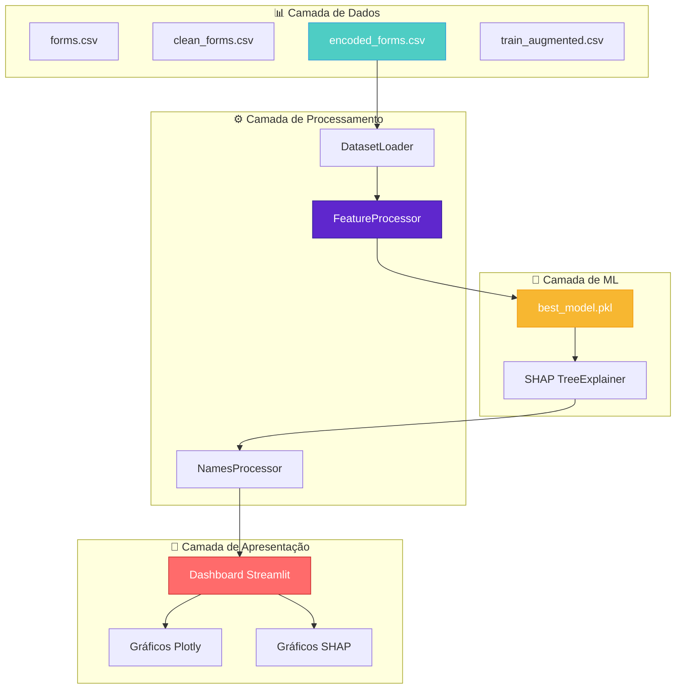
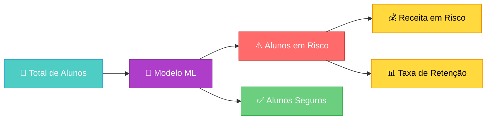
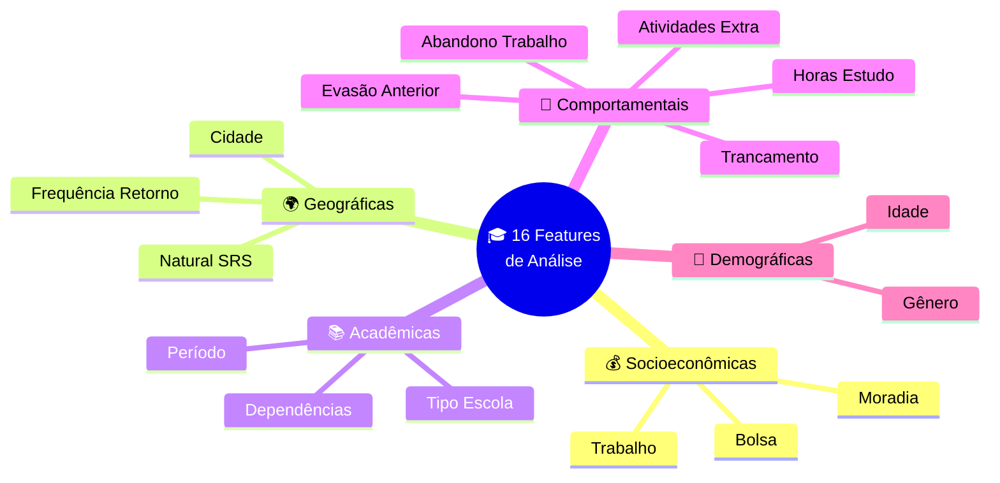
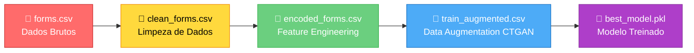
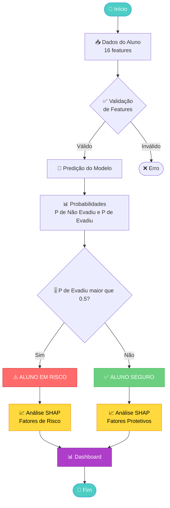
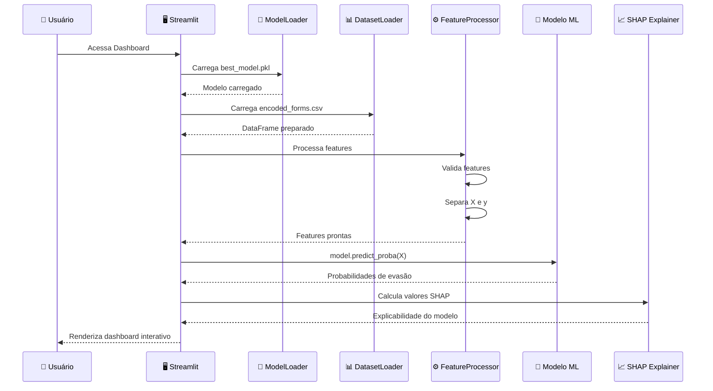

<h1 align="center">🎓 Sistema de Predição de Evasão Escolar</h1>

<p align="center">
  
  
  
  
</p>

> **Dashboard executivo de inteligência de negócios para análise preditiva e prevenção de evasão escolar baseado em Machine Learning e análise SHAP.**

## 📋 Sobre o Projeto

Este projeto é uma solução completa de **Business Intelligence** focada em combater a evasão escolar através de análise preditiva. O sistema utiliza Machine Learning para identificar alunos em risco de evasão e fornece insights acionáveis para tomada de decisão institucional.

### 🎯 Objetivos

- **Predizer** quais alunos têm maior probabilidade de evadir
- **Identificar** os principais fatores que contribuem para a evasão
- **Calcular** o impacto financeiro da retenção de alunos
- **Simular** cenários de intervenção e ROI
- **Fornecer** insights visuais e interativos para gestores educacionais

### ✨ Principais Funcionalidades

- 📊 **Dashboard Executivo Interativo** - Visualização em tempo real de métricas-chave
- 🔍 **Análise de Causas** - Identificação dos fatores mais impactantes na evasão
- 🏫 **Perfil Institucional** - Análise por dimensões socioeconômicas, geográficas, acadêmicas, comportamentais e demográficas
- 💡 **Insights Interativos** - Filtros dinâmicos para exploração de cenários
- 💰 **Simulador Financeiro** - Cálculo de impacto econômico e ROI de intervenções
- 📈 **Visualizações SHAP** - Explicabilidade do modelo através de gráficos detalhados

---

## 🏗️ Arquitetura do Sistema

### Visão Geral



---

## 🏗️ Estrutura do Projeto

```
c318-frontend/
├── app.py                      # Dashboard principal do Streamlit
├── main.py                     # Script de análise e visualização SHAP
├── pyproject.toml             # Configuração de dependências (uv/pip)
├── uv.lock                    # Lock file do gerenciador uv
│
├── database/                  # Dados do projeto
│   ├── clean_forms.csv       # Dados limpos
│   ├── encoded_forms.csv     # Dados codificados (features engineering)
│   ├── forms.csv             # Dados brutos originais
│   ├── train_augmented.csv   # Dados aumentados para treinamento
│   └── ctgan_outputs/        # Saídas do CTGAN (dados sintéticos)
│       └── quality_report.json
│
├── models/                    # Modelos treinados
│   └── best_model.pkl        # Modelo de ML otimizado
│
└── src/                       # Código fonte modular
    ├── __init__.py           # Setup e configurações
    │
    ├── constants/            # Constantes do projeto
    │   ├── __init__.py
    │   └── dataset.py        # Paths, features e mapeamentos
    │
    ├── loaders/              # Carregadores de dados e modelos
    │   ├── __init__.py
    │   ├── dataset.py        # Loader para CSVs
    │   └── model.py          # Loader para modelos .pkl
    │
    └── process/              # Processamento de dados
        ├── __init__.py
        └── feature.py        # Processamento e validação de features
```

---

## 🛠️ Tecnologias Utilizadas

### Core

- **[Python 3.13+](https://www.python.org/)** - Linguagem base do projeto
- **[Streamlit 1.51.0](https://streamlit.io/)** - Framework para dashboard interativo
- **[Scikit-learn 1.7.2](https://scikit-learn.org/)** - Machine Learning e modelagem preditiva

### Análise e Visualização

- **[SHAP 0.49.1](https://shap.readthedocs.io/)** - Explicabilidade de modelos (SHapley Additive exPlanations)
- **[Plotly 6.4.0](https://plotly.com/python/)** - Visualizações interativas
- **[Matplotlib 3.10.7](https://matplotlib.org/)** - Gráficos estáticos

### Utilidades

- **[Pandas](https://pandas.pydata.org/)** - Manipulação de dados (via sklearn)
- **[NumPy](https://numpy.org/)** - Computação numérica (via sklearn)
- **[Joblib 1.5.2](https://joblib.readthedocs.io/)** - Serialização de modelos

---

## 📦 Instalação

### Pré-requisitos

- Python 3.13 ou superior
- pip ou uv (gerenciador de pacotes)

### Opção 1: Usando `uv` (Recomendado)

```bash
# Clone o repositório
git clone <url-do-repositorio>
cd c318-frontend

# Instale as dependências com uv
uv sync

# Ative o ambiente virtual
source .venv/bin/activate  # Linux/Mac
# ou
.venv\Scripts\activate     # Windows
```

### Opção 2: Usando `pip`

```bash
# Clone o repositório
git clone <url-do-repositorio>
cd c318-frontend

# Crie um ambiente virtual
python -m venv .venv

# Ative o ambiente virtual
source .venv/bin/activate  # Linux/Mac
# ou
.venv\Scripts\activate     # Windows

# Instale as dependências
pip install streamlit scikit-learn shap plotly matplotlib joblib
```

---

## 🚀 Como Usar

### 1. Dashboard Interativo (Streamlit)

Execute o dashboard principal:

```bash
streamlit run app.py
```

O aplicativo será aberto automaticamente no navegador em `http://localhost:8501`

#### Funcionalidades do Dashboard:

**📊 Visão Geral**



- Total de alunos avaliados
- Número de alunos em risco
- Taxa estimada de retenção
- Receita em risco

**🔍 Aba: Causas da Evasão**

- Gráfico de barras com top N fatores de risco
- Impacto médio calculado via SHAP
- Controle interativo de quantos fatores exibir

**🏫 Aba: Perfil Institucional**

- Análise por dimensões:
  - **Socioeconômica**: Moradia, Trabalho, Bolsa
  - **Geográfica**: Cidade, Frequência de retorno, Natural de SRS
  - **Acadêmica**: Dependências, Período, Tipo de escola
  - **Comportamental**: Horas de estudo, Trancamentos, Evasões anteriores
  - **Demográfica**: Idade, Gênero

**💡 Aba: Insights Interativos**

- Filtros customizáveis (ex: bolsistas vs não-bolsistas)
- Probabilidade média de evasão por grupo
- Histograma de distribuição de risco

**🎯 Aba: Cenários Financeiros**

- Simulador de impacto por taxa de retenção
- Cálculo de receita preservada
- Tabela comparativa de cenários

**📈 Aba: ROI & Simulação**

- Configuração de investimento em intervenções
- Cálculo de ROI esperado
- Planejamento de orçamento de retenção

### 2. Análise SHAP (Script Python)

Execute análises detalhadas de explicabilidade:

```bash
python main.py
```

Este script gera:

- ✅ Gráfico de importância global das features
- ✅ Summary plot com distribuição SHAP
- ✅ Force plots individuais para cada aluno
- ✅ Análise agregada por categoria de features

---

## 📊 Dados e Features

### Categorias de Features

O modelo utiliza **5 dimensões** de análise:



#### 1. **Socioeconômicas** (3 features)

- Situação de Moradia
- Trabalho Atual
- Bolsa de Estudos

#### 2. **Geográficas** (3 features)

- Cidade de Origem (codificada)
- Frequência de Retorno à Cidade
- Natural de Santa Rita do Sapucaí

#### 3. **Acadêmicas** (3 features)

- Número de Dependências (ordinal)
- Período Atual
- Tipo de Escola de Origem

#### 4. **Comportamentais** (5 features)

- Horas de Estudo Semanais
- Abandono por Oportunidade de Trabalho
- Participação em Atividades Extracurriculares
- Trancamento Anterior de Disciplinas
- Evasão Anterior de Curso

#### 5. **Demográficas** (2 features)

- Faixa de Idade
- Gênero

### Pipeline de Dados



---

## 🧠 Modelo de Machine Learning

### Fluxo de Predição



---

## 🧠 Características do Modelo

### Características

- **Tipo**: Tree-based classifier (Random Forest ou Gradient Boosting)
- **Formato**: Arquivo `.pkl` serializado com joblib
- **Explicabilidade**: Integração com SHAP TreeExplainer
- **Target**: Variável binária `evadiu` (0 = Não evadiu, 1 = Evadiu)

### Métricas de Performance

O modelo foi otimizado para maximizar:

- Recall (identificar alunos em risco)
- Precision (minimizar falsos positivos)
- AUC-ROC (capacidade discriminativa)

---

## 🔧 Arquitetura do Código

### Módulos Principais

#### `src/constants/dataset.py`

Define constantes do projeto:

- Paths dos datasets
- Grupos de features por categoria
- Mapeamento de nomes legíveis

#### `src/loaders/`

Responsável por carregar recursos:

- **`dataset.py`**: Carrega CSVs em DataFrames
- **`model.py`**: Carrega modelos .pkl com validação

#### `src/process/feature.py`

Processa features para o modelo:

- **`FeatureProcessor`**: Valida presença de features, separa X e y
- **`NamesProcessor`**: Converte nomes técnicos para legíveis

### Fluxo de Execução



---

## 📈 Exemplos de Uso

### Analisar Impacto de Bolsistas

```python
# No dashboard, vá para aba "Insights Interativos"
# Selecione: "Mostrar apenas alunos com Bolsa de Estudos?" → "Sim"
# Observe a probabilidade média de evasão deste grupo
```

### Simular ROI de Programa de Retenção

```python
# Na aba "ROI & Simulação":
# - Taxa de sucesso: 70%
# - Custo por aluno: R$ 2.000
# - Investimento total: R$ 500.000
# → Sistema calcula ROI automaticamente
```

### Identificar Top 5 Fatores de Risco

```python
# Na aba "Causas da Evasão":
# Ajuste o slider "Número de fatores" para 5
# Observe o gráfico de barras com os maiores impactos SHAP
```

---

## 📝 Licença

Este projeto está sob licença MIT. Veja o arquivo [LICENSE](LICENSE) para mais detalhes.
